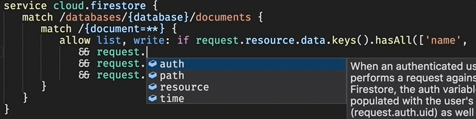
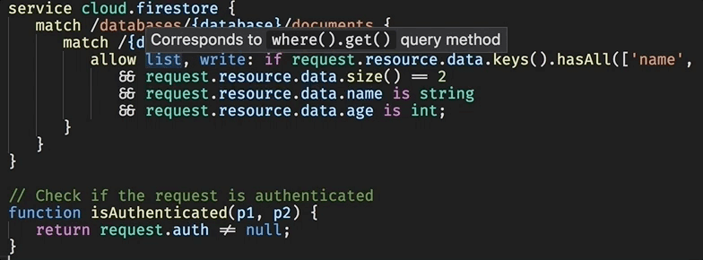
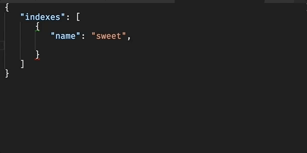
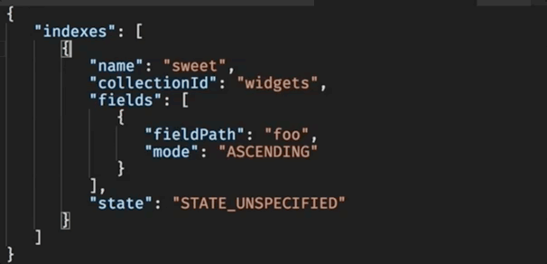

# Firestore Security Rules and Indexes

Syntax highlighting, code completions and hover help for new [Firestore security rules](https://cloud.google.com/firestore/docs/reference/security/) and [index definitions](https://cloud.google.com/firestore/docs/reference/rest/v1beta1/projects.databases.indexes). The priority for [additional rules language features](https://code.visualstudio.com/docs/extensionAPI/language-support) in roughly the order I'll get to them, if ever, is &hellip;

-  [x] Syntax Highlighting
-  [x] [Code Completions](#code-completions)
-  [x] [Hover Definitions](#hover-definitions)
-  [ ] Snippets
-  [ ] Signature Helpers
-  [ ] Incremental Formatting
-  [ ] Rule validation (moonshot)

### Rules

### Index Definitions

# Status

See the [repository milestones](https://github.com/toba/vsfire/milestones) for issues I expect to resolve in coming releases.
